## 
Instance Segmentation with Yolov8 and Detectron2:

# 
An attempt with custom-made data through Roboflow

---

### Introduction:

Roboflow is a powerful online tool that faciliate the segementaion process into few minutes withput going through countless days of coding. From then we can extract the manually labeled dataset for further training and processing. The tool support extraction in many formats, of which the most famous Detectron2 and YOLOv8, which are both powerful ready-made machine-learning-based tools

---
### Languages and Tools:

   

---
### Collecting raw dataset:

As a preliminary step, we took photos of 5 different obejct : , , Ticket, Glass, and Bolt 

#### Ticket: 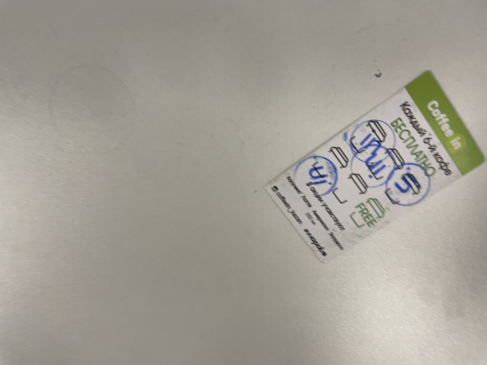
#### Glass: 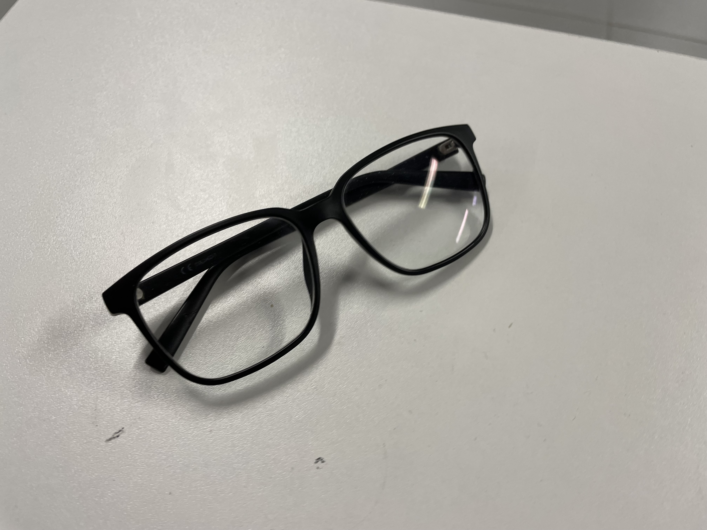
#### Battery: 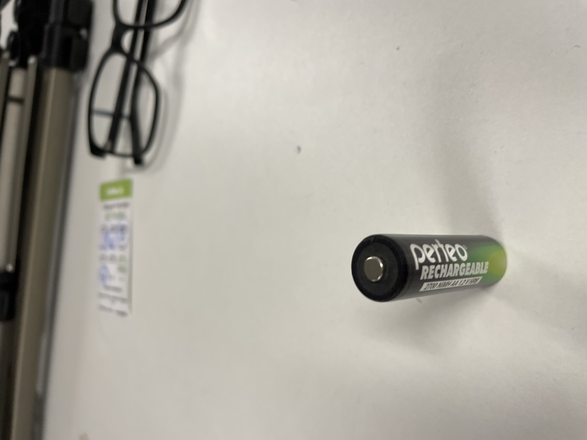
#### Pen: 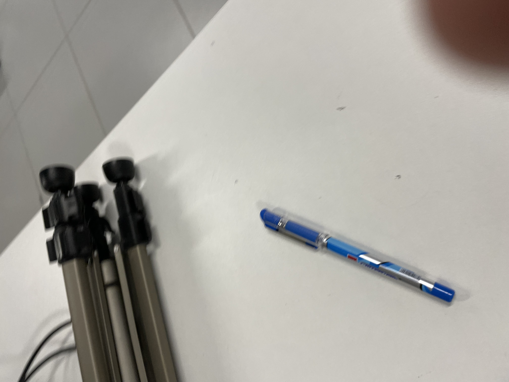
#### Bolt: 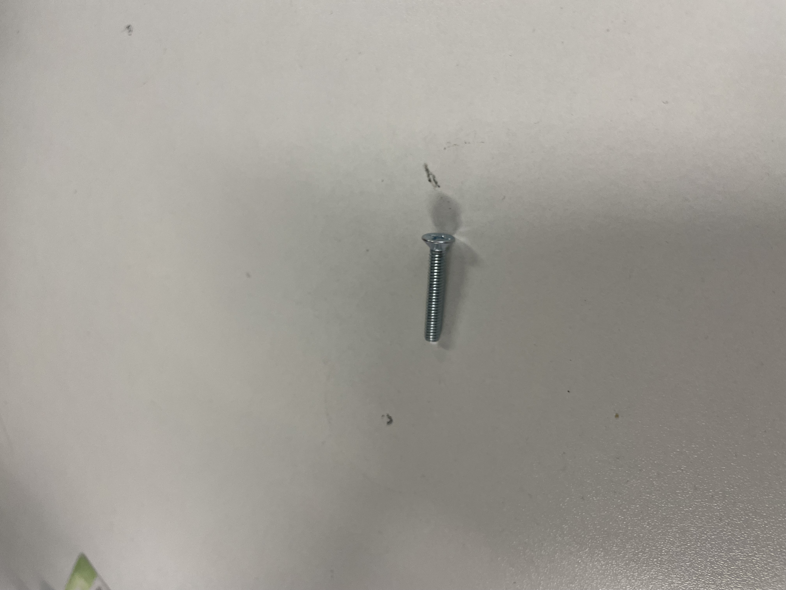

---
### Segemntaion:
As stated before, the annotation process was carried throught Roboflow, where i collected dataset of 110 and manually labeled them in their categories. The following screenshots show how:

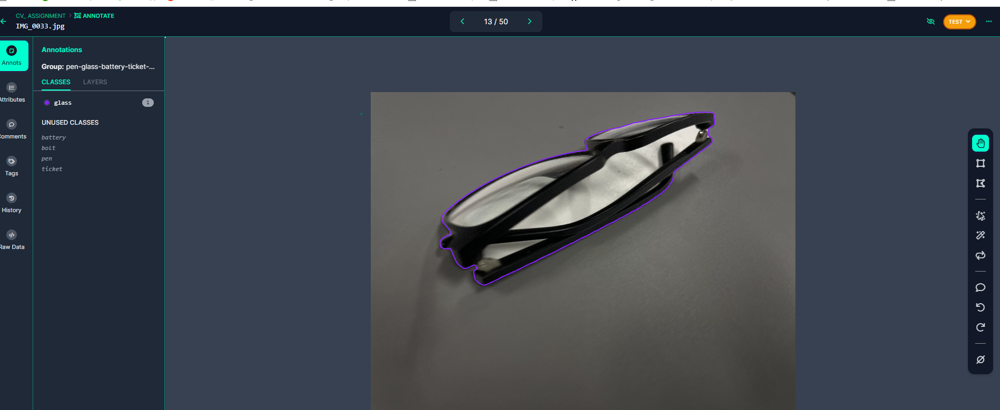
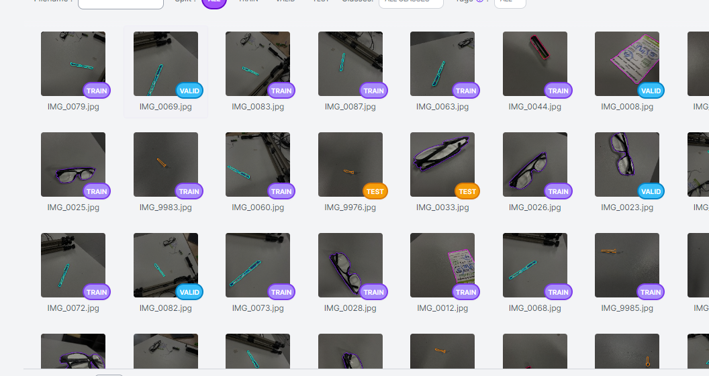

---
### RCNN MASk:
For this step we extracted the dataset into implemented it to Detectron2 model and trained it using Region Based Neural Network, RCNN, which  uses selective search to extract features based on regions from an image (these regions are called box):
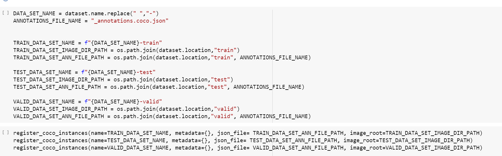

---
### YOLO.v8:

Then I take the same database adn pluge it into YOLOv*, a fast library that processes images, where we trained 25 Epochos:

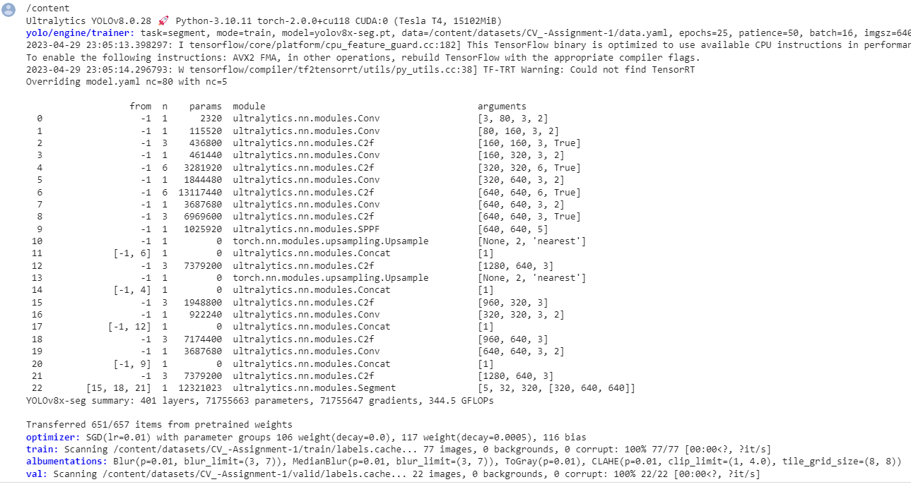

---
### Evaluate both models

Both models perform good. However, we can see there is a huge difference between the following metrices:
- Mean Average Precision (mAP).
- Speed
- Size

---
##### YOLO8: 
The model outperformed Detectrons as the mAP was about 99.5% and it visible in the following charts,The time it took 2-3 minutes, but the size was way larger where it was 640 MB.

---
##### Detectron2: 
The size was around 264 MB. However, it doesn't show promisng results as YOLO as it has mAP of 65% and the execution time reached areound ~20 minutes.

---
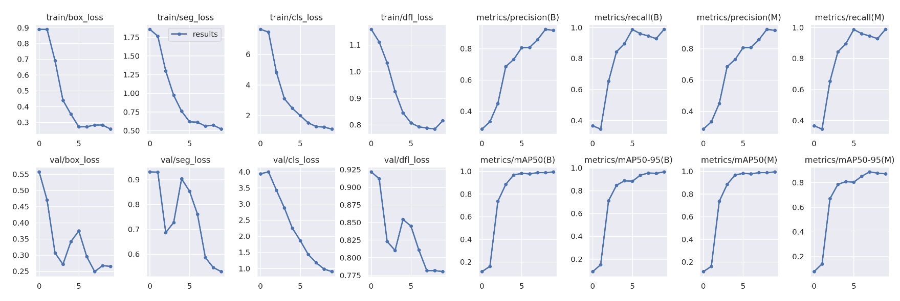
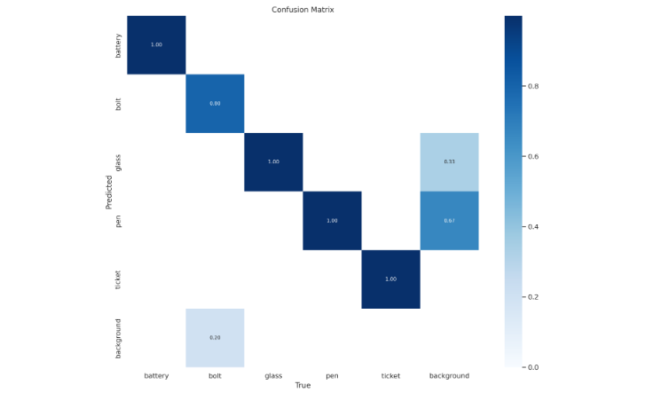

---
##### Kindly find the link to [Detectron2 model Colab notebook] and to [Yolo model Colab notebook] attached to this report

[Detectron2 model Colab notebook]: https://colab.research.google.com/drive/1xgDMn89tVSW5zxNB6zBWHUEapZxJsm4q?usp=sharing
[Yolo model Colab notebook]: https://colab.research.google.com/drive/1BFeFKfKfw_yopuUhNPjJGqakno18dj_y?usp=sharing
